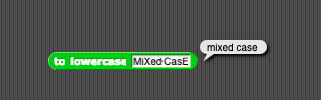

# Assignment Four: Show Top Trend Internationally

The goal of this assignment is to create a function takes a two digit country code and returns the top trend (from [Google Trends](https://trends.google.com/trends/?geo=US)) for that country. In the [project file](top-trend.xml) in this folder, you will find a function called `top trend in _` that accepts a two digit country code (from a dropdown list). Drag it on the scripting area of NetsBlox, right-click to edit the custom block, and you will find everything you need to get started.

Here are the blocks for the problem, jumbled up inside a function:

Please rearrange the blocks so that your function works as expected. If you want to, you can select alternative blocks. But these blocks are all you need to solve the problem.

You should make sure that your function passes these tests before submitting your work on Brightspace. Note that the trends may vary depending on the day.

This function uses the "Structured data" library from Netsblox, which can be imported from the "Libraries" list. The `value _ in _` function from the "Structured data" library allows you to select a value from a list of lists by providing its key.
