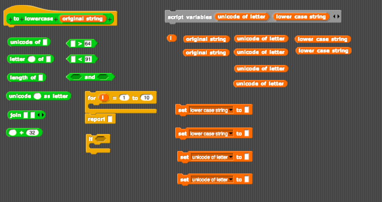
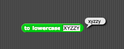

# Assignment Five: To Lowercase

The goal of this assignment is to create a function that converts any string to lower case. To write this function, you will need to make use of the [ASCII code](https://www.ascii-code.com/). I recommend that you spend some time looking at the relation between uppercase letters and lowercase letters in the code before you get started with the exercise.

In the [project file](to-lower-case.xml) in this folder, you will find a function called `to lowercase _` that accepts any string and converts any uppercase letters to lowercase, returning a string with all lower case letters. Drag the file onto the scripting area of NetsBlox, right-click to edit the custom block, and you will find everything you need to get started.

Here are the blocks for the problem, jumbled up inside a function:

Please rearrange the blocks so that your function works as expected. If you want to, you can select alternative blocks. But these blocks are all you need to solve the problem.

You should make sure that your function passes these tests before submitting your work on Brightspace.

