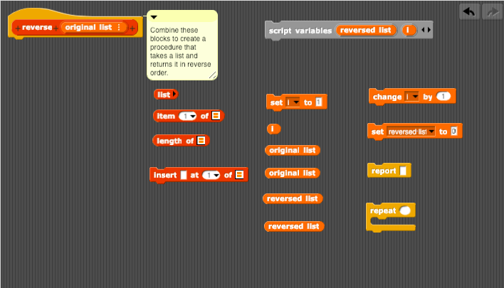

# Assignment Four: Reverse a List

The goal of this assignment is to create a function takes a list of any length and reports the list in reverse order. In the [project file](reverse-list.xml) in this folder, you will find a function called `reverse` that accepts a list as its argument. Just drag it on the scripting area of NetsBlox, right-click to edit the custom block, and you will find everything you need to get started.

Here are the blocks for the problem, jumbled up inside a function:

Please rearrange the blocks so that your function works as expected. If you want to, you can also select alternative blocks. But these blocks are all you need to solve the problem.

You should make sure that your function passes these tests before submitting your work on Brightspace.

