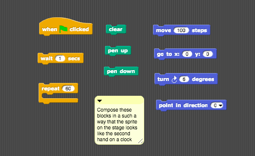
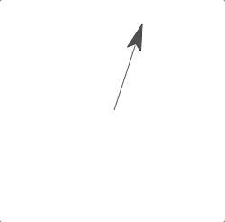

# Assignment One: Ticking Clock

The goal of this assignment is to create a sprite that moves on the stage like a second hand on a clock. The blocks you need are in the [project file](second-hand.xml) in this folder.

Download and drag the file onto your script area to begin. You must rearrange the blocks so that, when finished, your script looks something like the ticking second hand below.

When you have completed your assignment, export the project and upload it to the appropriate folder on Brightspace.

### Acknowledgements

This assignment has been adapted from the BJC curriculum. We will provide a reference to the corresponding project in BJC after everyone has submitted the assignment. In the meantime, no peeking!
