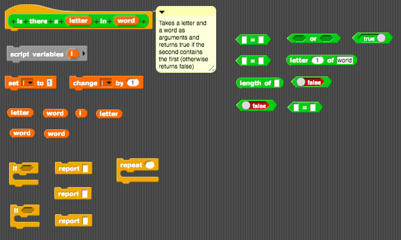
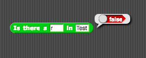
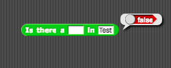

# Assignment Three: Contains Function

The goal of this assignment is to create a function that tests whether a given word contains any given letter. In the [project file](contains.xml) in this folder, you will find a function already created with two parameters: `letter` (i.e., the letter to look for in the word) and `word` (i.e., the word to check for the letter). If the word contains the letter, then your function should report `true`. If it does not, it should report `false`. The function should also report `false` if there is no argument provided for either the letter or the word (or both).

Here are the blocks for the problem, jumbled up inside a function:

Please rearrange the blocks so that your function works as expected. If you want to, you can also select alternative blocks. But these blocks are all you need to solve the problem.

You should make sure that your function passes these tests before submitting your work on Brightspace.

### Acknowledgements

This assignment has been adapted from the BJC curriculum. I will provide a reference to the corresponding project in BJC after everyone has submitted the assignment. In the meantime, no peeking!
