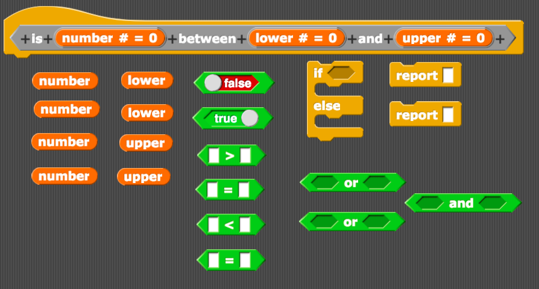
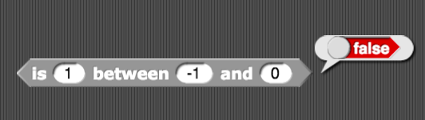
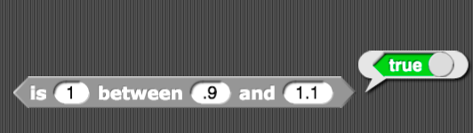
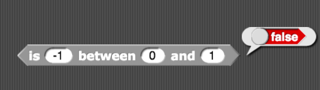
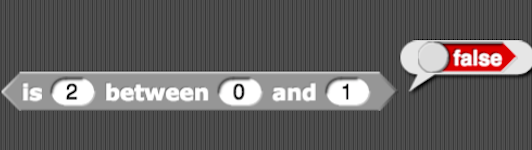
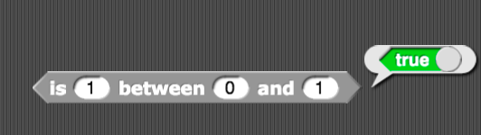

# Assignment Two: Between Function

The goal of this assignment is to create a function that tests whether any given number is between two other numbers. In the [project file](between.xml) in this folder, you will find a function already created with three inputs: `number` (i.e., the number to test), `lower` (i.e., the lower bounds), and `upper` (i.e., the upper bounds). If the number you are testing is equal to either the upper or lower bounds, you should also count it as between those numbers. The function should report either `true` or `false`.

Here are the blocks that you will need:

Please rearrange the blocks so that your function works as expected. You should make sure that your function passes these tests before submitting your work on Brightspace.

### Acknowledgements

This assignment has been adapted from the BJC curriculum. I will provide a reference to the corresponding project in BJC after everyone has submitted the assignment. In the meantime, no peeking!
